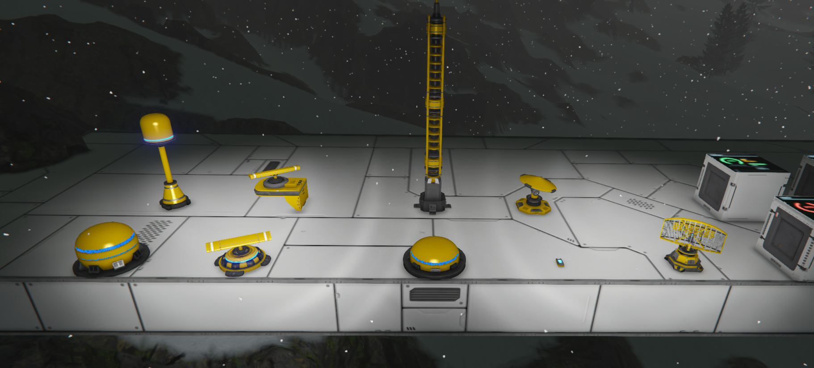
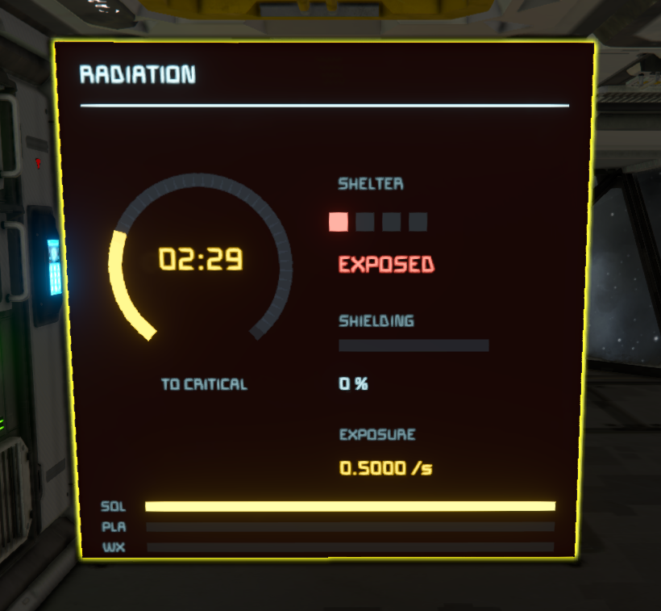
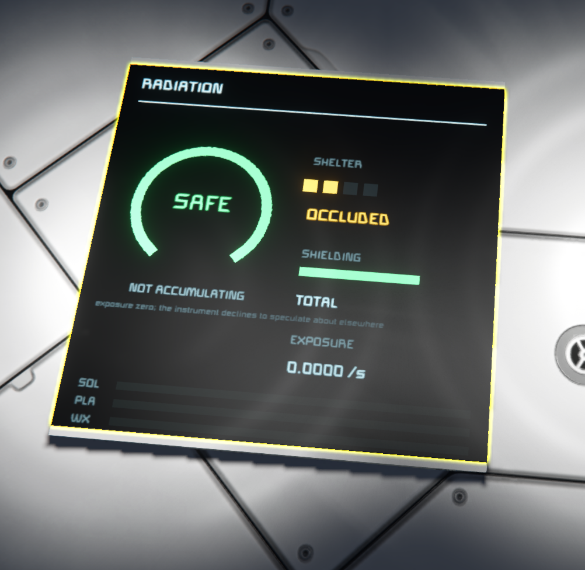
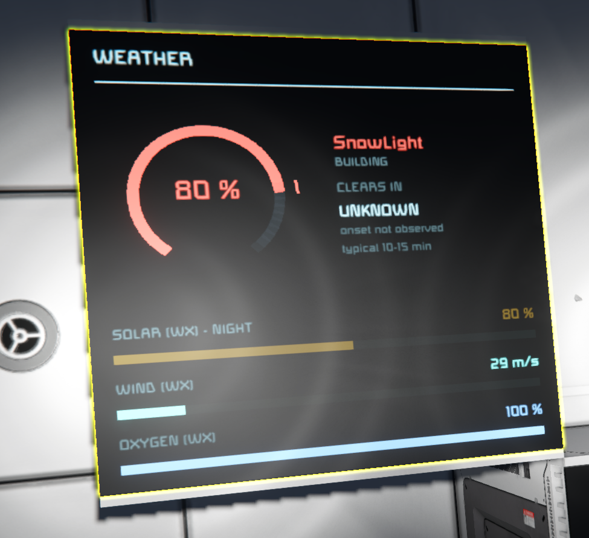
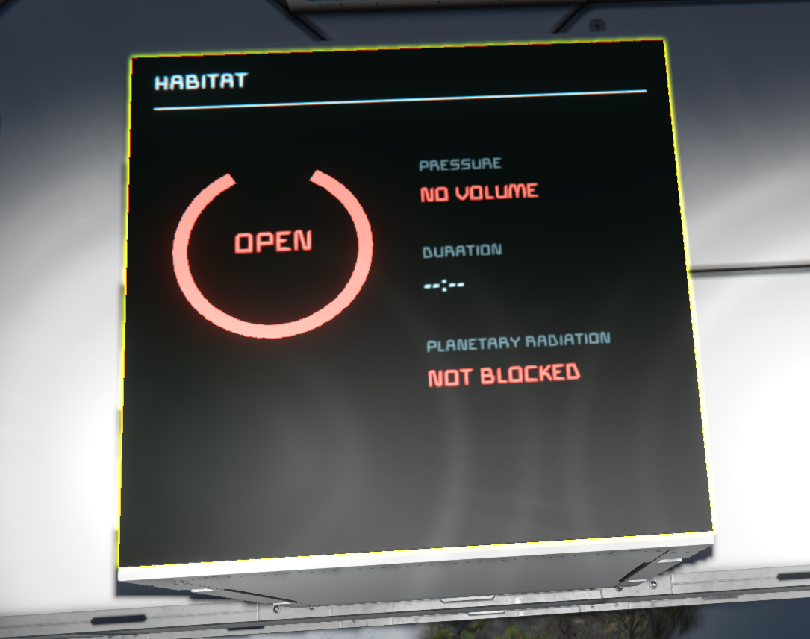
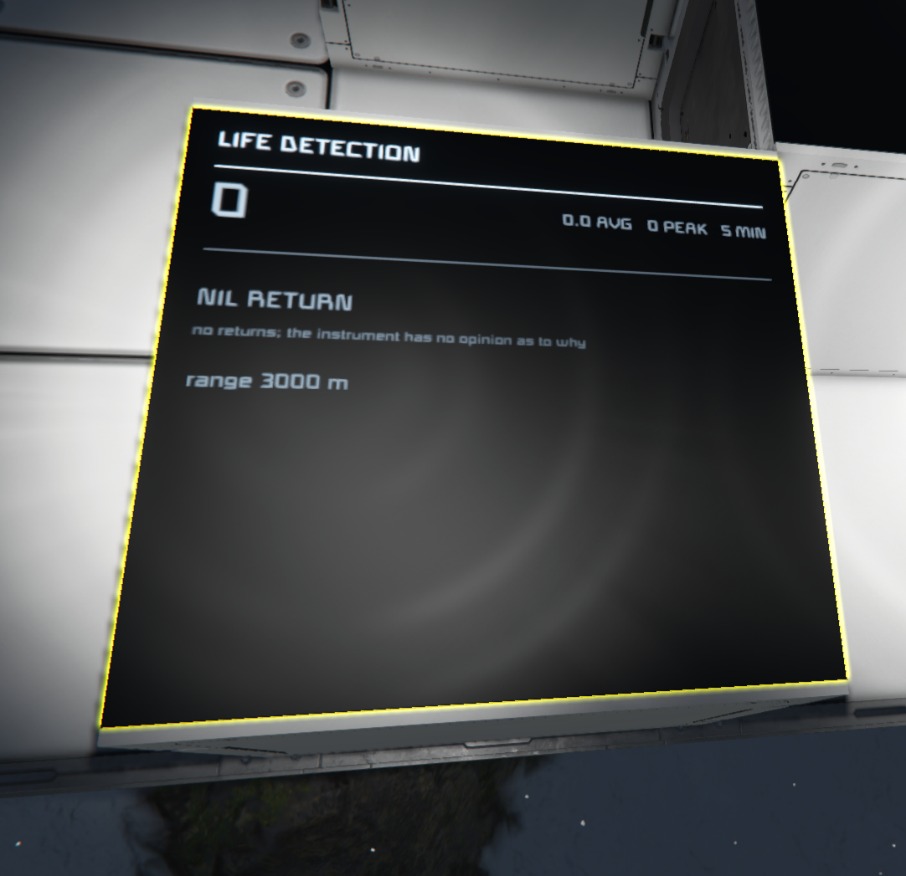

# Ground Truth — Environmental Instruments

Sensor blocks for Space Engineers that measure what is actually happening around a grid,
and report it accurately. Radiation, weather, atmosphere, life.

No progression, no gating, no tech tree. The instruments measure; what you do with the
readings is your business.

**Workshop:** https://steamcommunity.com/sharedfiles/filedetails/?id=3781444888



Radar domes, rotating sensor pods, wall-mounted dishes and the 1×5 comms mast — every
instrument comes in two silhouettes and both grid sizes, so an array can be built to look
like something rather than to look uniform.

---

## Screens

Each panel is an LCD app. No name tags and no setup — every app finds its own instruments
on its own grid.

| | |
|---|---|
|  |  |
| **Overview** — all four systems, laid out to fit the surface it is on. | **Strip** — for corner LCDs, where the other apps are unreadable. Small label, large value, colour for severity. |

| | |
|---|---|
|  |  |
| Exposed: dose accruing, shelter state `EXPOSED`, and how long you have. | Sheltered: the sun occluded, exposure genuinely zero. |

| | |
|---|---|
|  |  |
| Weather, with what it is doing to solar, wind and oxygen — and an honest `UNKNOWN` for a clearing time whose onset was never observed. | Habitat: no sealed volume here, so planetary radiation is `NOT BLOCKED`. |



Life Detection reporting a nil return — *"no returns; the instrument has no opinion as to
why"*. An instrument that finds nothing has not proved the place is empty.

---

## What is in this repository

| Path | Contents |
|---|---|
| `Data/` | the mod — block definitions, scripts, LCD textures |
| `Models/`, `Textures/` | art |
| `docs/INTEGRATION.md` | **API reference and integration guide** for scripters and modders |
| `docs/ENGINE_TRAPS.md` | **engine findings** — thirteen things that cost real time, published so nobody else pays for them twice |
| `probes/` | whitelist probe mods, ready to copy |
| `tools/` | the icon build pipeline |

`docs/`, `probes/` and `tools/` are excluded from the published mod.

---

## For scripters and modders

Start with [`docs/INTEGRATION.md`](docs/INTEGRATION.md). Around 75 terminal properties,
ten Event Controller events, documented conventions, and a stated version contract.

Short version:

```csharp
var sensors = new List<IMyUpgradeModule>();
GridTerminalSystem.GetBlocksOfType(sensors, b => b.GetValueFloat("GT_SysBlockRole") > 0);

float rads = sensors[0].GetValueFloat("GT_RadRate");   // -1 means "no reading"
```

Role numbers **1000+** are reserved for anyone publishing instruments that follow the same
conventions.

---

## For anyone modding Space Engineers at all

[`docs/ENGINE_TRAPS.md`](docs/ENGINE_TRAPS.md) is the part most likely to be useful to
people who never install this mod. Each entry is written symptom-first, because that is how
you meet them:

- Two `IsBot` properties that give opposite answers about the same creature
- Sprites that silently draw nothing unless registered as `LCDTextureDefinition`
- DDS textures the game ignores when they have no mip chain
- Definitions that pass a whitelist probe, compile, and never materialise at runtime
- The complete recipe for a **custom Event Controller event**, which the wiki describes in
  one sentence and which is otherwise most of a day of reverse engineering
- The Event Controller threshold slider that is labelled 0-100 and reports 0-1
- Antennas that draw a HUD marker with every box unchecked, why no mod can stop it, and
  what happens if you rip the component out anyway
- Why a test that produced nothing may have proved nothing — a false negative that cost a
  day and picked the wrong block type
- Giving a block a power draw in code, and why the obvious version reports `powered: True`
  while asking for 0.0000 MW

`probes/` holds the probe mods these came from. Most are tiny and execute nothing behind a
`const false` guard, answering "can mod code reach this" in one game load. Two of them do
run — `PaneProbe` places candidate block types and reports what the terminal draws, and
`HudMarkerProbe` strips a component to see what breaks. Copy one and point it at whatever
you are wondering about.

---

## Help wanted — visual work

The measuring is done and documented. What the project could genuinely use is someone with
an eye, because every visual decision here was made by an engineer optimising for legibility
and nothing else.

Four things, smallest first:

**Workshop imagery.** The page has honest screenshots taken to prove features work. It has
no header image, and no shot sequenced to show a newcomer in three seconds what this is.
That is a different craft from documenting a panel, and it is the gap most likely to decide
whether anyone installs the mod at all.

**Icons.** The G-menu icons are inherited from the source model packs. They are fine
individually and do not read as one family, which makes a deliberate eighteen-block shelf
look like a pile of borrowed parts.

**Panel layout.** The colour semantics are settled and load-bearing — green safe, amber
worth knowing, red happening to you, and the palette is documented in `TextPanels.cs`.
The *arrangement* is not sacred. Someone with real typographic sense could rework the
layouts inside those rules and the mod would be better for it.

**Block models.** The deep end. The meshes are MTGraves', used with permission and properly
credited, and they are why the instruments look as good as they do. Original models would
make this fully a Threshold Dynamics product rather than TD-branded naval props.

Open an issue or a pull request if any of that appeals. Code contributions are welcome
too, but the honest answer to "where would help matter most" is: not the code.

---

## Credits

Block models by **MTGraves**, from his Naval Theme Prop Pack and his comms pack, used
with explicit permission. Six textures the meshes reference are redistributed with them,
so the blocks look right without either pack installed.

Species icons derived from **Twemoji**, © Twitter Inc and contributors, CC-BY 4.0,
modified for LCD use.

Subpart rotation adapted from **Digi's** public spinning-subpart example.

Built with AI assistance — Claude, by Anthropic. There is a full account of how that
worked, including the mistakes, in
[`docs/INTEGRATION.md`](docs/INTEGRATION.md#how-this-was-built).
