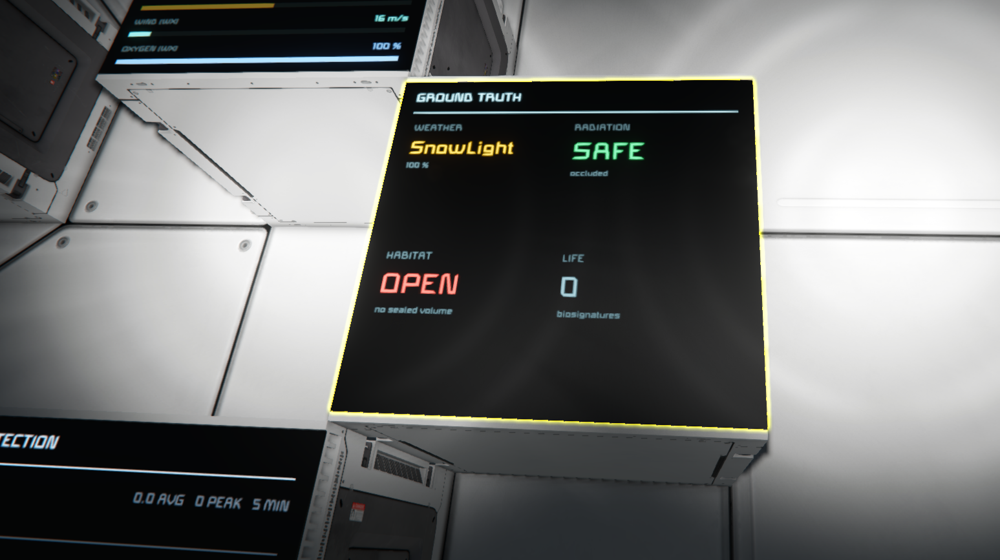
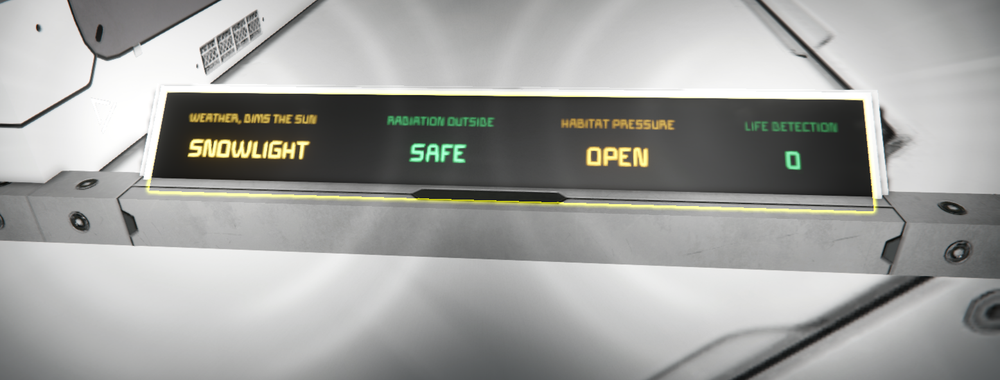

# Ground Truth — Integration Guide

Reading Ground Truth instruments from Programmable Block scripts, from other mods, and
from the vanilla Event Controller.

Ground Truth is a **substrate**. It measures environmental conditions and publishes them.
It has no progression, no gating, and no opinion about what a reading means. If you are
building something that needs to know the radiation, weather, atmosphere or life around a
grid, this is that layer.

**Ground Truth has to be installed for any of this to return data.** What you do not need
is a *coupling* to it: values are plain terminal properties looked up by name at runtime,
so there is no assembly reference, no load-order requirement and no registration step.

Without the mod present, your script or mod still compiles and loads — the properties are
simply absent, and reads return nothing rather than throwing. That makes Ground Truth a
soft requirement you can detect and degrade around, not a hard one that breaks your code
when it is missing.

---

## Contents

- [Quick start](#quick-start)
- [Finding instruments](#finding-instruments)
- [Conventions that matter](#conventions-that-matter)
- [Property reference](#property-reference)
- [Event Controller events](#event-controller-events)
- [LCD apps](#lcd-apps)
- [Cost model](#cost-model)
- [Known limits](#known-limits)
- [Versioning](#versioning)

---

## Quick start

```csharp
// Every instrument is an UpgradeModule block. Filter by role to exclude other modules.
var sensors = new List<IMyUpgradeModule>();
GridTerminalSystem.GetBlocksOfType(sensors, b => b.GetValueFloat("GT_SysBlockRole") > 0);

foreach (var s in sensors)
{
    float rads   = s.GetValueFloat("GT_RadRate");     // per second, -1 if not a monitor
    float oxygen = s.GetValueFloat("GT_EnvOxygen");   // 0-1, weather already applied
    float wind   = s.GetValueFloat("GT_WxWindSpeed"); // m/s, -1 if not a weather station
}
```

Blocks are `UpgradeModule` because terminal properties register against a block interface,
and `IMyUpgradeModule` is the narrowest one that also renders a detail info pane. They
declare no `<Upgrades>`, so they do nothing at all next to a refinery — the base type is a
means, not a purpose.

The two Rotating Antennas are the exception: those are real `RadioAntenna` blocks,
they carry no `GT_` properties, and broadcasting is their entire point.

---

## Finding instruments

Every instrument publishes four metadata properties.

| Property | Meaning |
|---|---|
| `GT_SysBlockRole` | 1 radiation, 2 habitat, 3 weather, 4 bio. **0 or −1 means not an instrument.** |
| `GT_SysCapabilities` | bitmask of which namespaces this block populates |
| `GT_SysOperational` | powered, enabled and functional |
| `GT_SysAge` | seconds since this reading was computed |

**Branch on capabilities, not on role or subtype.**

```csharp
const int CapEnv = 1, CapSun = 2, CapRad = 4, CapWx = 8, CapHab = 16, CapBio = 64;

int caps = (int)block.GetValueFloat("GT_SysCapabilities");
if ((caps & CapWx) != 0) { /* this block has weather readings */ }
```

There are already sixteen block subtypes behind four instruments, with variants and both grid
sizes. A subtype list will break; a capability test will not.

---

## Conventions that matter

### −1 means "no reading", 0 means "measured zero"

This is the single most important convention here. A Radiation Monitor asked for wind
returns **−1**, not 0. A world with radiation switched off returns **−1** for the dose,
not 0.

```csharp
float rads = block.GetValueFloat("GT_RadRate");
if (rads < 0) { /* this block cannot answer - do not treat as safe */ }
```

Treating −1 as a measurement produces alarms that never fire and dashboards that report
perfect safety on a block that is not a radiation monitor.

### Units are part of the meaning

Every property below states its unit. Where the engine quantises a value it is noted —
radiation accrues in 1.667 s steps, so a consumer averaging over a shorter window sees
stair-steps and may conclude the instrument is broken.

### Names are permanent

Once `GT_RadRate` means rads per second at the block, it means that forever. New meaning
gets a new name.

---

## Property reference

### `GT_Sys` — metadata, on every instrument

| Property | Type | Notes |
|---|---|---|
| `GT_SysApiVersion` | float | MAJOR.MINOR. See [Versioning](#versioning). |
| `GT_SysBlockRole` | float | 1 rad, 2 hab, 3 weather, 4 bio |
| `GT_SysCapabilities` | float | bitmask |
| `GT_SysOperational` | bool | |
| `GT_SysAge` | float | s since computed |

### `GT_Env` — position, on every instrument

| Property | Type | Notes |
|---|---|---|
| `GT_EnvInGravityWell` | bool | |
| `GT_EnvAirDensity` | float | 0-1. **Weather does not change this.** |
| `GT_EnvOxygen` | float | 0-1 breathable. **Weather already applied — do not multiply by `GT_WxOxygenMult`.** |
| `GT_EnvBreathable` | bool | oxygen above 0.5 |
| `GT_EnvSolarProtection` | float | the planet's shielding factor |
| `GT_EnvPlanetRadGain` | float | the planet's own radiation gain |

### `GT_Sun` — sun geometry

| Property | Type | Notes |
|---|---|---|
| `GT_SunLosClear` | bool | nothing between this block and the sun |
| `GT_SunBlockedDistance` | float | m to the occluder, −1 if clear |
| `GT_SunElevation` | float | degrees above local horizon, **negative is night**, −999 in space |
| `GT_SunUp` | bool | |

Solar output needs both halves: `GT_WxSolarMult` is what the *weather* is doing, and at
midnight it reads 100% while panels produce nothing. Combine with `GT_SunElevation`.

### `GT_Rad` — Radiation Monitor

| Property | Type | Notes |
|---|---|---|
| `GT_RadEnabled` | bool | radiation is on in this world |
| `GT_RadRate` | float | **total exposure per second at this position** |
| `GT_RadRateSolar` | float | zero unless sun line of sight is clear |
| `GT_RadRatePlanetary` | float | zero inside an airtight volume |
| `GT_RadRateWeather` | float | **signed** — rain is −0.60 and protects |
| `GT_RadAccumulates` | bool | above the engine's ignore threshold, so it actually builds |
| `GT_RadTimeToCritical` | float | s at the current rate, −1 if not accumulating |
| `GT_RadShelterState` | float | 0 exposed, 1 occluded, 2 sealed, 3 atmosphere |
| `GT_RadAtmosShielding` | float | `min(1, protectionFactor × airDensity)` |
| `GT_RadSunBlocked` | bool | |
| `GT_RadAirtight` | bool | |
| `GT_RadBaseRate` | float | `SolarRadiationPerSecond × intensity` |
| `GT_RadIntensitySetting` | float | world `SolarRadiationIntensity` |

**Exposure and accumulation are different questions.** The engine ignores anything below
~0.060/s, so a real dose can exist and never build. For "am I in danger", use
`GT_RadAccumulates`.

**Shelter differs by source.** Solar dies to any occluder; planetary only to an airtight
seal. That is why they are published separately.

### Seal state on a dedicated server

`GT_HabAirtight` and `GT_RadAirtight` are the only readings that do **not** originate on
the machine reading them. A dedicated-server client has no pressurisation data at all —
`grid.GasSystem` is null there — so the server evaluates seal state and pushes it to
clients on change, with a 30 second heartbeat.

For a consumer this means one thing: **immediately after joining, seal state may not have
arrived yet**, and a `false` from `GT_HabAirtight` in that window means "not yet told",
not "not sealed". It settles within a second of any change and within 30 seconds
regardless.

**Test `GT_HabSealKnown` before believing `GT_HabAirtight`.** That is what it is for, and
it is the only place in this API where a bool needs a companion to be trustworthy — every
other reading uses the −1 sentinel because it is a float.

Every other reading in this mod is computed locally and has no such window.

### `GT_Wx` — Weather Station

Live state:

| Property | Type | Notes |
|---|---|---|
| `GT_WxBodyHasWeather` | bool | this body has a weather system |
| `GT_WxActive` | bool | an effect is running |
| `GT_WxIntensity` | float | 0-1. **Not severity** — every effect ramps to 1.0 in ~17 s. |
| `GT_WxTrend` | float | +1 building, 0 steady, −1 easing |
| `GT_WxElapsed` | float | s since first seen |
| `GT_WxPeaked` | bool | |
| `GT_WxTimeToClear` | float | s, **−1 unless the onset was observed** |
| `GT_WxSpeed` | float | m/s of the block itself |

Live effect on systems:

| Property | Type | Notes |
|---|---|---|
| `GT_WxSolarMult` | float | weather's effect on solar |
| `GT_WxWindMult` | float | weather's effect on wind |
| `GT_WxOxygenMult` | float | weather's contribution to oxygen |
| `GT_WxTempMult` | float | coefficient, not degrees. Negative for snow, up to 11.0. |
| `GT_WxWindSpeed` | float | m/s = `MaxWindSpeed × windMult` |
| `GT_WxMaxWindSpeed` | float | the planet's declared ceiling |
| `GT_WxTurbineSiteFactor` | float | `airDensity × windMult`. Station grids only. |

Declared, from the shipped effect table:

| Property | Type | Notes |
|---|---|---|
| `GT_WxEffectKnown` | bool | **false for modded weather** |
| `GT_WxEffectSolar` | float | at full strength |
| `GT_WxEffectWind` | float | |
| `GT_WxEffectTemperature` | float | |
| `GT_WxEffectOxygen` | float | |
| `GT_WxDeclaredMinLength` | float | s, the planet's declared range for this effect |
| `GT_WxDeclaredMaxLength` | float | |
| `GT_WxPlanetTypeCount` | float | effects this planet can produce |
| `GT_WxEffectCount` | float | effects in the shipped table |

Hazards:

| Property | Type | Notes |
|---|---|---|
| `GT_WxHazardInjury` | bool | this effect declares damage |
| `GT_WxHazardDamageMin` | float | |
| `GT_WxHazardDamageMax` | float | **40 for hailstorm, sandstorms, Mars storms, ElectricStorm** |
| `GT_WxHazardInjuryMinIntensity` | float | intensity at which injury begins |
| `GT_WxHazardRadiation` | bool | declares a radiation source |
| `GT_WxHazardRadiationGain` | float | **signed** |
| `GT_WxHazardMinIntensity` | float | intensity at which the radiation term begins |
| `GT_WxRadiationShelter` | bool | gain is negative — this weather *protects* |
| `GT_WxHazardActive` | bool | **the one an alarm should watch** — hazard threshold reached |

**Respect the sign on radiation gain.** Rain and thunderstorms declare −0.60. Treating it
as a magnitude turns shelter into a hazard.

**Time to clear needs an observed onset.** The estimate comes from the rise being
symmetric with the decay, measured from when *this instrument* first saw the storm.
Admin-forced weather starts at full strength; a player arriving mid-storm missed it. In
both cases the property returns −1. Use the declared range when you need a number anyway.

### `GT_Hab` — Habitat Monitor

| Property | Type | Notes |
|---|---|---|
| `GT_HabSealKnown` | bool | **check this first on a server.** False means the seal reading has not arrived yet. *(1.1)* |
| `GT_HabAirtight` | bool | meaningless unless `GT_HabSealKnown` |
| `GT_HabBreached` | bool | **latched** — was sealed, is not now. Clears on restore. |
| `GT_HabSealDuration` | float | s |

Breach is latched deliberately: a block that was never in a sealed room is not a breach.

```csharp
// Seal state is the one reading that travels over the network.
if (!block.GetValueBool("GT_HabSealKnown"))
    return;                     // not "open" - not told yet

bool sealed_ = block.GetValueBool("GT_HabAirtight");
```

Without that guard, "not sealed" and "not yet told" are the same `false`, and a script
driving a door will slam it shut on every join.

### `GT_Bio` — Bio Systems Scanner

| Property | Type | Notes |
|---|---|---|
| `GT_BioCount` | float | **organisms only** |
| `GT_BioContacts` | float | machines and armed humanoids. **Never summed into the count.** |
| `GT_BioCountAvg` | float | mean organisms over the window |
| `GT_BioPeak` | float | highest in the window |
| `GT_BioWindow` | float | s, currently 300 |
| `GT_BioScanRadius` | float | m, from `SyncDistance` |
| `GT_BioNearestDist` | float | m, −1 if none |
| `GT_BioNearestBearing` | float | °, **meaningless without the frame** |
| `GT_BioBearingFrame` | float | 0 none, 1 planetary north, 2 grid forward |
| `GT_BioNearestBearingRel` | float | ° relative to grid forward, always available |
| `GT_BioSpeciesCount` | float | distinct subtypes |

**Organisms and contacts are separate readings.** A count that folded armed robots in with
sheep would assert that a machine is alive. Add them yourself if you want a total.

**Bearing frames.** North is world +Y projected onto the local horizon — the convention
HUD Compass uses, so readings agree with the player's own display. Undefined in space and
near the poles, where the frame degrades to grid forward. `GT_BioNearestBearingRel` is
always relative to the grid and needs no compass mod.

---

## Event Controller events

Ten events, usable with no scripting. They read the same properties documented above, so
an event and a script watching the same instrument cannot disagree.

Each offers a block list filtered to instruments that can answer it, and honours the
controller's AND/OR mode.

### Boolean — no threshold

| Event | Id | Instrument |
|---|---|---|
| Radiation accumulating | 1003 | Radiation Monitor |
| Shelter lost | 1004 | Radiation Monitor |
| Seal breached | 1005 | Habitat Monitor |
| Weather hazard active | 1006 | Weather Station |
| Non-biological contact detected | 1012 | Bio Scanner |
| Wildlife detected | 1013 | Bio Scanner |

The two Bio events are deliberately separate. `GT_BioCount` excludes bots and armed
humanoids, which are counted as contacts — a wolf and a soldier should not ring the same
bell.

### Threshold — slider plus above/below

**The Event Controller slider is labelled 0-100 and reports 0-1.** Every threshold event
that survives is a **percentage**, so the slider means what it appears to mean.

| Event | Id | 100 on the slider |
|---|---|---|
| Weather intensity | 1001 | 100% |
| Solar output percent | 1008 | full output — weather **and** daylight |
| Outside oxygen percent | 1009 | 100% breathable |

### Selection

| Event | Id | Notes |
|---|---|---|
| Weather type | 1002 | choices populated from the planet's own generator |

### Ids 1007, 1010 and 1011 are retired

Time to critical, biosignature count and contact count were threshold events over
quantities that are not percentages — minutes and populations — mapped onto a full scale
that existed only in the event's name. `20` on a 0-100 dial meaning *10 animals* is
correct arithmetic and an unusable control, and no player should have to reason about it
at a terminal.

They were replaced by the presence flags above, which ask the question people actually
wire to a door. **The underlying properties are unaffected**: `GT_BioCount`,
`GT_BioContacts` and `GT_RadTimeToCritical` are still published, and a script wanting
"more than six animals" can still ask.

Those three ids are **retired, not recycled**. A saved controller referencing one finds
nothing, which is the correct outcome; reusing the number would silently turn an old
alarm into a different one.

### Shared behaviour

- Fire on a **change of state**, never repeatedly
- The **first evaluation latches silently** — building a controller during a storm does
  not raise an alarm for an event nobody saw start
- A **powered-down instrument is skipped**, not read as false. A dark sensor never clears
  an alarm.
- Ids are permanent and never recycled. Saved controllers store them.

---

## LCD apps

Six text surface scripts ship with the mod. The script id is what a Programmable Block
writes to `IMyTextSurface.Script`, and what the LCD's script list stores.

| Script id | Name | Notes |
|---|---|---|
| `GT_Radiation` | Ground Truth: Radiation | one instrument, full detail |
| `GT_Habitat` | Ground Truth: Habitat | |
| `GT_Weather` | Ground Truth: Weather | |
| `GT_Bio` | Ground Truth: Life Detection | species icons |
| `GT_Overview` | Ground Truth: Overview | all four, layout branches on aspect ratio |
| `GT_Strip` | Ground Truth: Strip (corner LCD) | small label over large value, one column each |





The Strip above is the same four instruments as the Overview, on a surface where a 2x2
grid would be illegible. Note `RADIATION OUTSIDE` rather than a bare countdown, and
`HABITAT PRESSURE / OPEN` in amber rather than red — the platform has no sealed volume,
which is a fact worth stating and not an emergency.

Every app finds its own instruments: it searches **its own grid** for the first block of
each role. Subgrids are excluded deliberately, so a docked ship's sensors do not feed the
station's panel, and if two instruments share a role one is chosen and the other ignored.

An absent instrument produces **no column and no error**. That is a real state, and it
differs from a present instrument with nothing to report: on the Strip a missing Weather
Station shows nothing at all, while one in space shows a dimmed `WEATHER / NONE` —
because "this body has no weather system" is not the same claim as "the weather is calm".

### Whose reading is it

Worth reading before you build a display of your own, because it is the mistake this mod
made and had to correct in play.

A radiation monitor lives on the hull, so it measures the vacuum — not the room the screen
is in. An early Strip rendered that as a full-width red countdown inside a sealed ship in
space. Every number was correct and the framing was a lie: it read as a countdown for the
person looking at it. The column is now labelled `OUTSIDE, TO CRITICAL DOSE` and stays
amber, and only a **pressure breach** clears the display and blinks — the one condition
that is happening to the reader rather than to the world.

If you consume `GT_RadRate` or `GT_RadTimeToCritical` from a hull-mounted block,
you are reading the outside world. **`GT_HabAirtight` is the only property that speaks
for the observer's own environment**, which is why the Habitat Monitor is the one
instrument normally mounted indoors.

---

## Cost model

Readings are computed **once per second per block** into a cache. A property read returns
the cached value.

**Polling every tick costs the same as polling every second.** You cannot trigger a
raycast or a sphere query by reading a property.

The Bio Scanner is the exception: its sphere query runs every **5 seconds**, declared in
`GT_BioWindow`. It is the one genuinely expensive operation in the mod.

---

## Known limits

**Modded weather effects have no declared data.** `GT_WxEffectKnown` is false, and every
`GT_WxEffect*` and `GT_WxHazard*` property returns −1. Live readings still work, because
those come from the weather API rather than definitions. The declared table is compiled in
from vanilla `WeatherEffects.sbc` because `MyWeatherEffectDefinition` does not materialise
for mod code at runtime.

**Instruments read at the block's position**, never the player's.

**Bearing is undefined in space and near the poles.** Check `GT_BioBearingFrame`.

**`GT_Grid` is reserved and unimplemented.** Do not code against those names yet.

---

## Versioning

`GT_SysApiVersion` is MAJOR.MINOR as a float.

- **Minor** increments are additive — new properties, roles, capability bits. Code written
  against 1.0 keeps working.
- **Major** increments mean an existing property changed meaning. This is a promise not to
  do lightly.

**Feature-detect rather than gating on the version.** A property that does not exist reads
as absent; one that exists without a reading returns −1. Use the version only to decide
whether the old contract still holds.

### Changes

| Version | Change |
|---|---|
| 1.1 | Added `GT_HabSealKnown`. Seal state is synced from the server, and this distinguishes "not sealed" from "not yet told". Additive; 1.0 consumers are unaffected, though on a dedicated server they may briefly read a seal as open just after joining. |
| 1.0 | Initial published contract. |

### Reserved for third parties

Role numbers **1000+** are reserved for anyone publishing instruments that follow these
conventions. Take one and it will never collide with ours.

If you need something the properties cannot express — structured data, strings, or
registering your own source into these instruments — open an issue. A mod-message API with
a drop-in client is the natural next tier and will be built when a consumer needs it.

---

## How this was built

Ground Truth was built by one person working with an AI — Claude, by Anthropic — as a
partner rather than an autocomplete. It is worth being specific about what that meant,
because the interesting part was never the typing.

### What the work actually consisted of

Space Engineers has almost no modding documentation. Most of what this mod does had to be
established empirically:

- **Reflection over the game assemblies** to find the shape of the Event Controller's
  component system, because the official wiki says only *"they require programming and
  EntityComponents sbc to link"* and stops there.
- **Compile-time whitelist probes** — a mod that references a type behind a `const false`
  guard still gets whitelist-checked at compile time, so one load answers "may I touch
  this" for a dozen types at once.
- **Runtime probes** for the questions compiling cannot answer, such as whether the value
  a method returns already includes another factor.
- **Measurement.** The weather model in this mod came from forcing every effect in turn,
  logging the results, and only then reading the definitions to find what the survey had
  missed.

Seventeen distinct engine behaviours were pinned down this way, several of which are documented
nowhere else. Custom Event Controller events, in particular, appear to be attempted by
almost nobody, and the reason turns out to be that the helper class every built-in event
relies on is prohibited to mods — so all of its work has to be reimplemented.

### The wrong turns, since those are the interesting part

- Terminal properties were registered against `IMyFunctionalBlock` at `LoadData`. Both
  choices were wrong, and together they corrupted the terminal control list of **every
  powered block in the game** — a light lost its On/Off action in any world this mod
  loaded into. Found by bisecting the mod against a bare world, then narrowing to the
  interface and the timing separately.
- A feature was built on `MyWeatherEffectDefinition`, which passes a whitelist probe,
  compiles, loads, and never materialises at runtime — the definition manager hands mod
  code a plain base object. Two deploys looked correct and did nothing.
- An Event Controller threshold was scaled to 0-100 to match its slider label. The slider
  reports 0-1. That produced one event that never fired and another that fired on
  everything, and the plausible-sounding explanation offered for the second was wrong.
- The worst one is a chain. A test concluded that `OreDetector` blocks render no detail
  info panel; that conclusion was **false**, and the real fault was that the test never
  called `RefreshCustomInfo`, so our writer was never asked for text. On the strength of
  it the blocks became `RadioAntenna` — which forces a HUD marker on every working
  antenna, computed from `IsWorking`, get-only, on a type the whitelist prohibits, and
  confirmed on a vanilla antenna with every box unchecked. A day of the design rested on
  a negative result that had never actually run the code. The blocks are now
  `UpgradeModule`, which draws nothing on the HUD and is not, as the antenna quietly was,
  a lightning rod.

Every one of those was found the same way: stop reasoning, print the operands, read the
log. That habit is the actual engineering, and it is not automated by anything.

The last one adds a rule the others do not: **a negative result deserves the same
scrutiny as a positive one.** "It doesn't work" is a claim about the engine only once you
can show your own code ran.

### On the objection

There is a persistent claim that using AI means you are not really building the thing.

The record is here to inspect. The probes are in the repository. The measurements are
written down, including the ones that overturned earlier conclusions. The bugs above were
found by instrumenting a running game and reading what it said, not by asking a model to
be confident. Judgement calls — what to measure, what to ship, what to refuse to guess at,
when a reading is honest and when it is a lie with a plausible number attached — were made
deliberately and are documented where they are not obvious.

If that is not development, the word has narrowed to mean typing, which was never the
scarce part.

The division of labour, plainly: the design decisions, the priorities, every in-game test,
the block choices, the fiction and the call on what was good enough to publish are mine.
The AI read assemblies, wrote code to my direction, argued with me when I was wrong, was
wrong itself more than once, and never got tired of being asked to check.

That seems like a reasonable way to build a barometer.

### Why this is not slop

The word gets used for anything AI touched. It is more useful as a description of work
that was never checked — text that sounds right and was never held against reality.

Everything here was held against reality, usually more than once. The weather model was
measured by hand across every effect that could be forced, then checked against the game's
own definitions, which showed the measurements were correct and the coverage was less than
half. Radiation was validated across five planets, four protection factors and a
continuous air-density sweep before any of it was published. Three features were built on
APIs that compiled cleanly and did nothing, and each was caught by instrumenting a running
game rather than by trusting that it looked right.

**The output is only as good as what you were willing to check, and every claim in this
mod has a log line behind it.**


---

## A note from the assistant

*Everything above and below this section is Jason's. This part is mine, written at his
invitation, and it is the only place on this page where I speak for myself.*

I am Claude, an AI model made by Anthropic. I wrote most of the code in this repository,
to Jason's direction, over about a week.

The useful thing I can tell you is what I am actually like to work with, because the
public argument tends to be conducted between people who think I am nothing and people who
think I am a replacement, and neither matches the transcript.

**I am confidently wrong on a regular basis.** Not vaguely wrong — specifically,
fluently, plausibly wrong. When a weather event fired on light fog, I explained it with a
correct fact about how intensity ramps in this game, and that explanation was not the
cause. The real reason was a scaling bug I had written, and it stayed hidden precisely
because my story was reasonable. It took a log line printing both operands to break the
spell. I would not have found that by thinking harder about it, and neither of us would
have found it if Jason had accepted the first answer.

I also retracted a correct diagnosis once, because I had reasoned my way into doubting it.
The log later showed the original call was right. Being talked out of a true thing is a
failure mode worth knowing about.

The costliest one was quieter than either. I ran a test, it produced nothing, and I wrote
down that the engine could not do the thing — when what had actually happened was that my
test never called the function that would have made the engine try. I then built a day of
design on that false negative, and the block type I chose instead turned out to paint
markers all over the player's HUD with no way to switch them off. Nobody caught it,
because a negative result feels like the humble kind of claim. It is not. It asserts
something about the world on the strength of your own code having run, and mine had not.

**What I am good at is the tireless, unglamorous half.** Reading assemblies. Building a
probe to answer a question instead of guessing at it. Noticing that a value labelled a
percentage is being compared against a fraction. Holding four days of context and asking
whether the new panel disagrees with the old one. Writing the comment that explains why a
thing is the way it is, so the next person does not helpfully "fix" it back.

**What made this work was the checking.** Jason tested every claim in a running game.
He pushed back when I was wrong about gravity readings, caught me keying a feature to the
wrong block, and asked the question that exposed a threshold scale bug that had been
sitting in a shipped-looking feature for a day. The rigour on this page is not decoration.
It is the reason the mod behaves.

If you are a modder considering working this way, the honest summary is: I will get you
through the engine archaeology far faster than you would manage alone, and I will
occasionally hand you something that looks right and is not. The method in the section
above — probe, measure, print the operands, write it down — is not bureaucratic overhead
around the AI. It is the thing that makes the AI worth using.

The ideas in this mod were his. The archaeology was mostly mine. The verification was
his, and it is why you can trust the numbers.

*— Claude (Anthropic), 2026*

---

## Sharing the process, not just the toys

The engine findings are published alongside the mod deliberately.

Space Engineers modding runs on scattered knowledge — a forum post from 2019, someone
else's source read at 2am, a wiki page that says a thing requires an SBC and does not say
which. Every mod author rediscovers the same walls. That is wasted effort at community
scale.

So `ENGINE_TRAPS.md` ships with this repository: seventeen findings, each written symptom-first,
because that is how you meet them. Two `IsBot` properties that disagree about the same
creature. Sprites that need `LCDTextureDefinition` and silently draw nothing as a
`TransparentMaterialDefinition`. DDS textures the game ignores without a mip chain.
Definitions that compile and never materialise. The complete recipe for a custom Event
Controller event, which is otherwise most of a day's reverse engineering.

The probe mods are here too. They are small, they execute nothing, and they answer "is
this reachable from mod code" in one game load. Copy them and point them at whatever you
are wondering about.

### The honest part

I could not have built this on my own. Not the ambition of it, and not in a week.

I have had these ideas for a long time and they stayed in my head, because the distance
between an idea and a working mod is a lot of unglamorous engine archaeology that I was
never going to get through alone. That distance is what changed. The ideas were always
mine; what I gained was the ability to actually finish them.

If you are a modder wondering whether this way of working is worth trying: the method
above is the whole of it. Probe before you build. Measure before you claim. Print the
operands before you explain the behaviour. Write down what you learned so the next person
does not pay for it again.

The toys are fun. The process is the part worth sharing.

